# 09_Praktikum 5

BAHASA PEMROGRAMAN

TEHNIK INFORMATIKA

UNIVERSITAS PELITA BANGSA

NAMA : GUNAWAN

NIM     : 312010191

KELAS   : TI.20.B1

DOSEN   : Agung Nugroho,S.Kom.,M.Kom

Tugas : Pertemuan 9

**Praktikum 5**

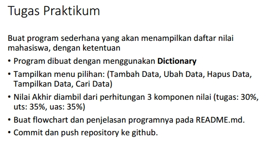
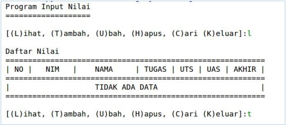
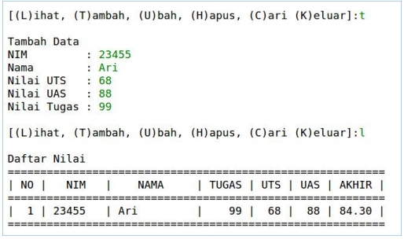

- Kita ketik Code perintah python yang sudah kita buat nama Praktikum5.py : 

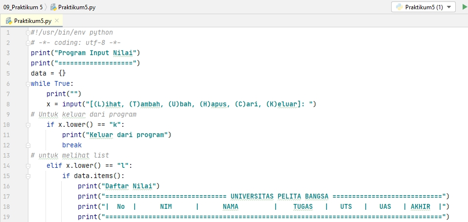
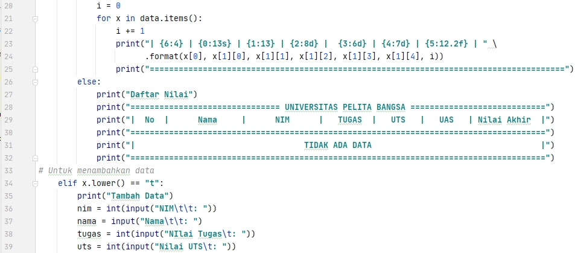
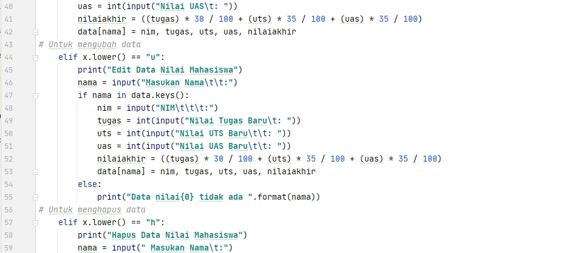
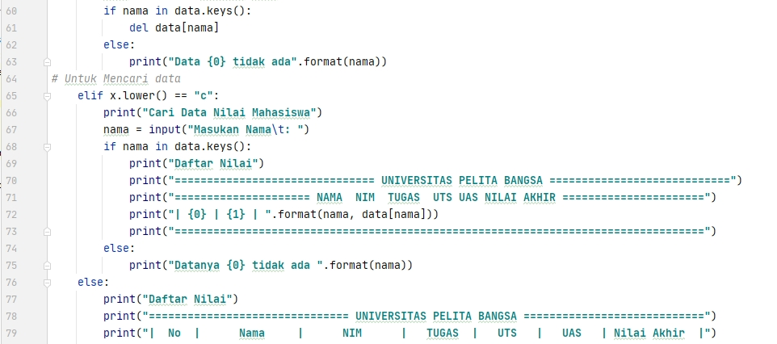
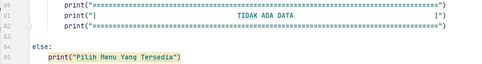

   **Berikut tampilan hasil code program setelah di Run :**
   
- Melihat Daftar nilai mengetik perintah : ``l`` dan menambah Data ketik : ``t``

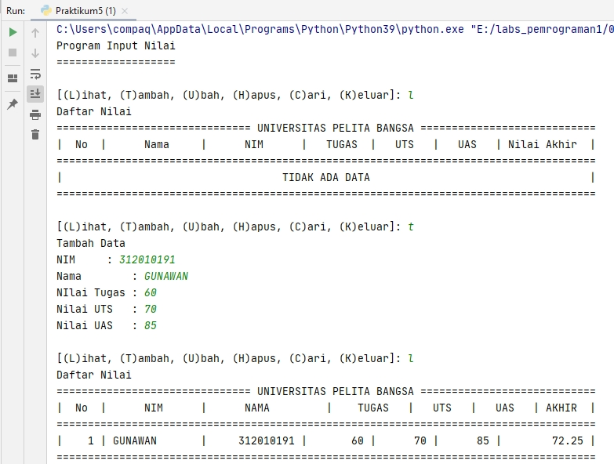

>Menambah data Ke 2 ketik perintah : ``t`` dan untuk mengubah Data ketik : ``u``
>Untuk Menghapus Data ketik perintah : ``h``

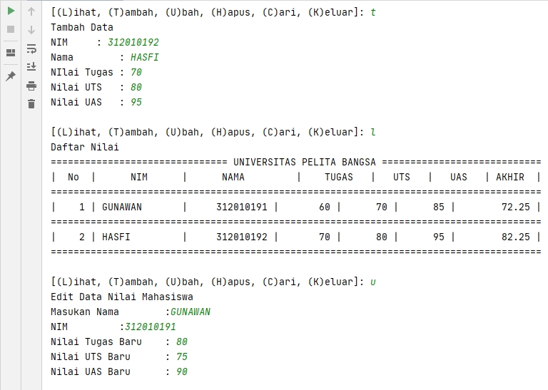
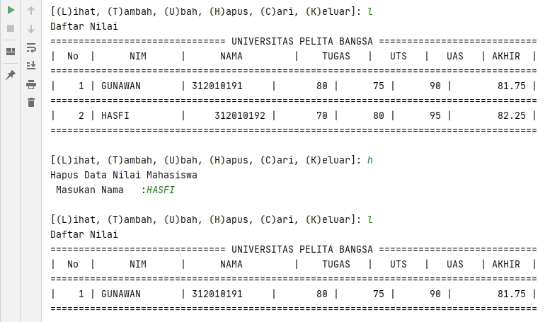

>Mencari data nilai Mahasiswa ketik perintah : ``c``

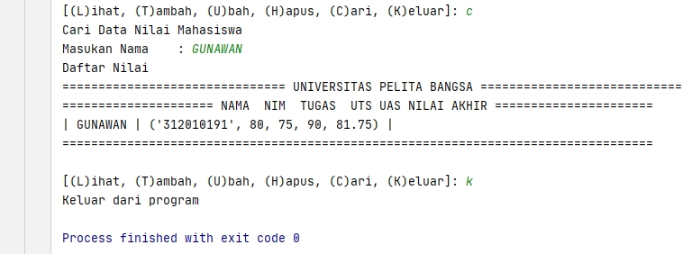

>Untuk Keluar program ketik perintah : ``k``

Cukup sekian penjelasan dari saya.

**Terimakasih**